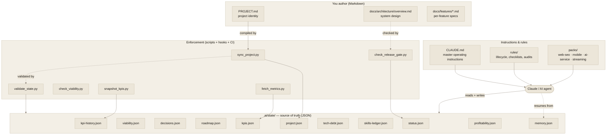
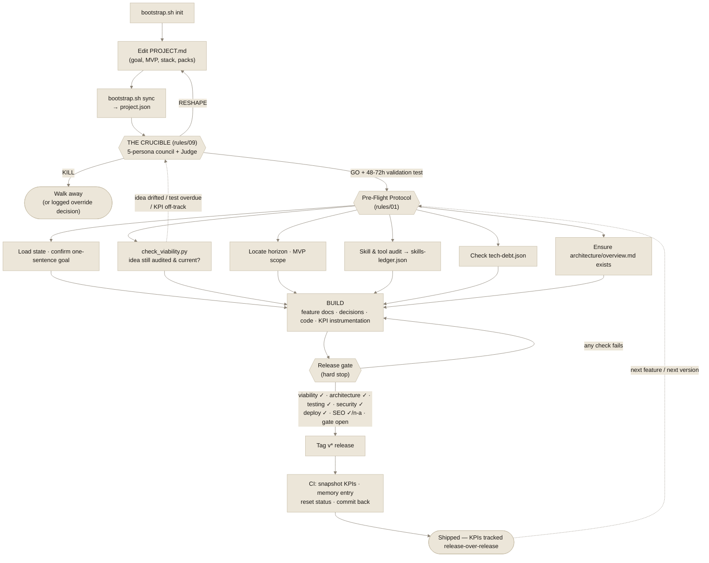
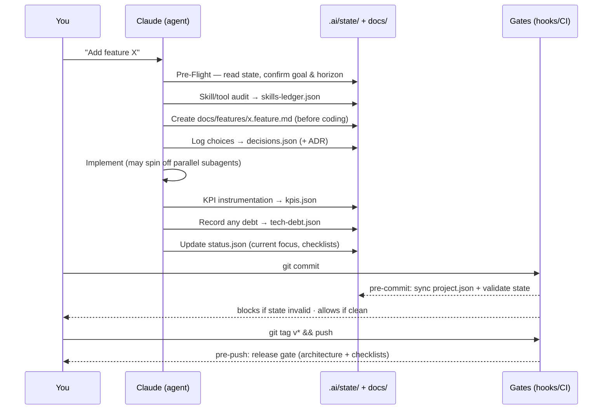
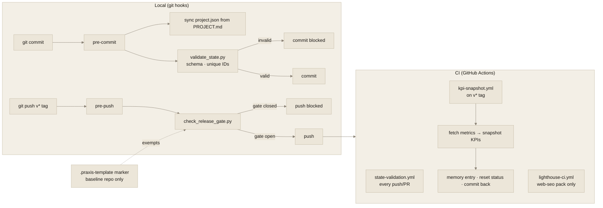
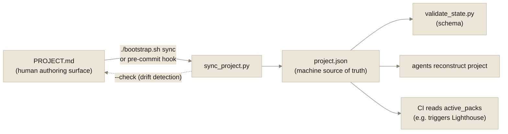
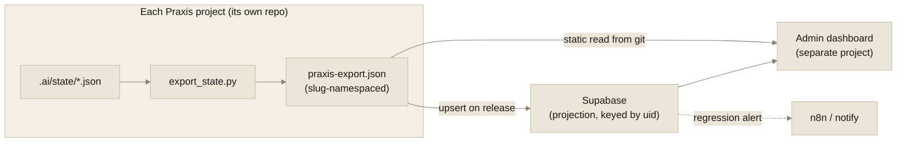

<div align="center">

<picture>
  <source media="(prefers-color-scheme: dark)" srcset="assets/brand/lockup-dark.svg">
  
</picture>

<p>
  <em>πρᾶξις</em> · /ˈprak.sis/ · ancient Greek, n.<br>
  Activity engaged in by free people — the process by which<br>
  <strong>theory becomes disciplined, repeatable action.</strong>
</p>

<p>
  
  
  
  
</p>

</div>

---

The AI-native operating system for disciplined building. Drop it into **any** repo — web, SaaS,
iOS/tvOS, Android, streaming/OTT, AI service — and every agent that touches the project works to the
same standard, even after context is compacted.

## The core idea

Your context window is volatile; **the JSON in `.ai/state/` is not**. Claude reconstructs the project from
those files every session. The rules enforce a disciplined lifecycle with hard release gates. The packs add
domain specifics only when you need them. You author the project's identity in friendly Markdown
(`PROJECT.md`); Praxis compiles it into the machine-readable `project.json` the rest of the system trusts.

> **The golden rule:** *If it isn't written to the relevant `.ai/state/*.json`, it didn't happen.*

## How Praxis works (visual)

### 1. The system at a glance
What lives in a Praxis-equipped repo and how the pieces relate. You author Markdown; Praxis compiles and
validates the machine state; rules and scripts enforce discipline; agents read state to work.



### 2. Project lifecycle — from empty repo to shipped release
The path a project takes. Pre-Flight runs before every unit of work; the release gate is a hard stop.



### 3. Adding a feature — the inner loop
Every feature follows the same disciplined path, so any agent can resume it cold and state never drifts.



### 4. Enforcement — why state can't silently drift
Discipline is machine-enforced at three moments: commit, tagged push, and CI.



### 5. Authoring identity — Markdown in, validated JSON out
You never hand-edit `project.json`; it's generated and kept in lockstep with `PROJECT.md`.



## What's inside
- **`CLAUDE.md`** — master instructions, auto-loaded by the Claude VS Code extension. Start here.
- **`PROJECT.md`** — the human authoring surface for the project's identity (name, goal, MVP, stack, packs).
  Edit this, then `./bootstrap.sh sync` compiles it into `.ai/state/project.json`. **You edit the Markdown;
  the JSON is generated.**
- **`.ai/state/`** — 11 JSON source-of-truth files: project, viability (Crucible verdict), decisions,
  roadmap, kpis, kpi-history, tech-debt, skills-ledger, memory, profitability, status. (`project.json` is
  generated from `PROJECT.md`.)
- **`.ai/schemas/`** — JSON Schemas validating every state file.
- **`rules/`** — 10 operating rules: general behavior, lifecycle, state management, testing / security /
  deployment / SEO checklists, skill-audit protocol, profitability & marketing, and the Crucible
  (idea viability audit — GO/RESHAPE/KILL + 48–72h validation test).
- **`docs/`** — feature docs (resumable per feature), architecture, and human-readable ADRs.
- **`packs/`** — opt-in overlays: `web-seo`, `mobile`, `ai-service`, `streaming`.
- **`bootstrap.sh`** — install into a new repo, validate state, scaffold features.
- **`assets/brand/`** — the Praxis identity: mark, lockups, palette, voice ([guide](assets/brand/README.md)).
  Deliberately not copied by `init` — projects built on Praxis carry their own brand.

## Quick start
```bash
# From this baseline directory:
./bootstrap.sh init /path/to/new-project "My Project"
cd /path/to/new-project
# Open in VS Code — CLAUDE.md loads automatically.
# Edit PROJECT.md (goal, MVP, type, stack, packs) — the human authoring surface. Do NOT edit project.json.
./bootstrap.sh sync .             # compile PROJECT.md -> .ai/state/project.json
./bootstrap.sh validate .         # check JSON + schemas
```
Then tell Claude: **"Run the Pre-Flight Protocol in CLAUDE.md."**

> Editing project identity is Markdown-first: author `PROJECT.md`, run `sync`. The pre-commit hook also
> regenerates `project.json` from `PROJECT.md` automatically, so the two never drift.

## The non-negotiables this enforces
1. A goal stated in **one sentence**.
2. An idea that **survived the Crucible**: an adversarial 5-persona audit with a GO/RESHAPE/KILL verdict
   and a 48–72h validation test — re-triggered automatically when the idea drifts or reality disagrees.
3. **Short / mid / long-term** horizons on every major decision.
4. A clear **MVP** definition; scope creep goes to the roadmap, not the MVP.
5. **Every decision** logged in machine-readable JSON (survives compaction).
6. A **growth roadmap** in JSON.
7. **KPIs** defined, instrumented, and **snapshotted per release** for progress tracking.
8. A **skill/tool audit** before every project and feature (incl. aitmpl.com skills and 21st.dev UI refs),
   with an add/remove/replace **ledger**.
9. A **technical-debt** register that flags manual work to automate.
10. **`docs/features/`** breakdowns so AI can resume any feature.
11. **Testing / security / deployment** (and **SEO + page-speed** for web) as **hard release gates**, with
    status written back to JSON.
12. Permission to **spin off parallel agents** for throughput.
13. A **project memory** file so any agent onboards fast.
14. A built-in **path to profitability** (email capture, cross-marketing, cross-sell) tied to KPIs.
15. A **marketing plan** that fuels growth and ties back to KPIs.

## Portfolio dashboard (the export contract)
Because all project state is normalized, typed JSON, you can point an admin dashboard at it without scraping.
`./bootstrap.sh export` emits **`praxis-export.json`** — a stable, versioned projection (`export_contract_version`)
with portfolio-safe `uid`s (`<slug>:<id>`), precomputed rollups, and a flattened relationship graph. A
dashboard is a **separate project** that consumes this contract — read it straight from git, upsert it into
Supabase on each release for cross-project queries, or publish it as a release asset. Praxis can evolve its
internal schemas freely as long as the exporter keeps emitting the contract. Schema:
`.ai/schemas/praxis-export.schema.json`; details in `scripts/README.md`.



## Maintaining the baseline
Version it. When you improve a rule or schema here, new projects get it on their next `init`. Existing
projects can re-copy individual files. Treat this repo as the canonical template for the whole portfolio.

### Iterating on Praxis as you use it
Praxis is designed to improve through contact with real projects. A tight loop:

1. **Hit friction in a project** → note what the baseline didn't cover or got wrong.
2. **Fix it here**, in the canonical repo (a rule, schema, script, or pack).
3. **Bump the version** and tag it (`git tag vX.Y.Z`), so projects can pin to a known-good baseline.
4. **Propagate**: new projects pick it up via `bootstrap.sh init`; existing ones re-copy the changed files.

Keep changes disciplined — the tool that enforces discipline should be built with it:
`scripts/validate_state.py` runs on every commit, and the CHANGELOG/tags are the baseline's own KPI history.

## Who's behind this

Praxis is designed and maintained by **[Marcos J. Reyes](https://itsmarcosjreyes.com)** — an engineering
leader who builds AI-native systems in public. It began as the internal standard behind his own project
portfolio: every repo he starts is bootstrapped from this baseline, every idea faces the Crucible before a
line of code, and every release passes the same gates you see here. Praxis sits alongside **KineticOS**,
his AI-native personal operating system, in the **Kinetic Matrix** body of work.

If Praxis shapes how you build, say so — and tell him what broke. The baseline improves through contact
with real projects.

- Site: [itsmarcosjreyes.com](https://itsmarcosjreyes.com)
- GitHub: [@itsmarcosjreyes](https://github.com/itsmarcosjreyes)

---

<div align="center">

<picture>
  <source media="(prefers-color-scheme: dark)" srcset="assets/brand/mark-dark.svg">
  
</picture>

<p><em>If it isn't written, it didn't happen.</em></p>

<sub>PRAXIS · Discipline, by design · © 2026 <a href="https://itsmarcosjreyes.com">Marcos J. Reyes</a> · A Kinetic Matrix standard</sub>

</div>
