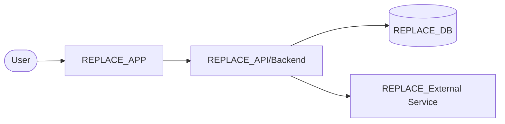
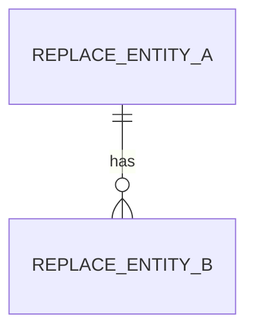

# Architecture Overview

> **REQUIRED & GATE-ENFORCED.** Every Praxis project must fully describe its architecture here. The release
> gate (`scripts/check_release_gate.py`) blocks any `v*` release until this file exists, contains no
> `REPLACE_`/`<FILL…>`/`<...>` placeholders, and has real substance. This is a file-based check on purpose:
> a self-reported checkbox could lie; the document cannot. Keep it current — it's the map any agent or human
> uses to understand the system without reading all the code.
>
> Delete this blockquote and every `REPLACE_`/`<...>` marker as you fill it in.

- **Project:** REPLACE_PROJECT_NAME
- **Last updated:** REPLACE_ISO_DATE
- **Maintainer:** marcos@kineticmatrix.io
- **Related:** `.ai/state/project.json` (one-sentence goal), `.ai/state/decisions.json` (ADRs), `docs/decisions/`

## 1. System context (the one-paragraph version)
REPLACE_SUMMARY — What this system is, who uses it, and how it delivers the one-sentence goal. What are the
external actors and systems it talks to? Keep it to a paragraph a new engineer could read in 30 seconds.

## 2. Components
Describe each major component: its responsibility, what it owns, and what it must NOT do. Replace the rows.

| Component | Responsibility | Owns | Tech | Notes / boundaries |
|---|---|---|---|---|
| REPLACE_frontend | <what it does> | <data/UI it owns> | <e.g. Next.js on Vercel> | <boundary> |
| REPLACE_backend | <what it does> | <domain it owns> | <e.g. Supabase> | <boundary> |
| REPLACE_jobs | <async/compute> | <queues/jobs> | <e.g. Modal / n8n> | <boundary> |

## 3. Data model
The core entities, their relationships, ownership, and lifecycle. Replace with the real model.

REPLACE_DATA_MODEL — list entities and relationships (or embed an ER diagram). Note source of truth for each
entity, retention/deletion policy, and any PII (ties to `rules/04-security-checklist.md`).

## 4. APIs & contracts
REPLACE_API — Key interfaces (REST/GraphQL/RPC/events), auth model, versioning strategy, and error
conventions. Link any contract decisions in `decisions.json`. Note what is public vs internal.

## 5. External dependencies & integrations
REPLACE_DEPENDENCIES — Third-party services, SDKs, and APIs the system relies on (analytics, payments, auth,
DRM, LLM routing, etc.). For each: what it's used for, failure behavior, and the blast radius if it's down.

## 6. Infrastructure & deployment
REPLACE_INFRA — Environments (dev/staging/prod), hosting topology, CI/CD pipeline, and how a change reaches
production. Reference `rules/05-deployment-checklist.md`. Note secrets management and observability
(logging, metrics, tracing) — if it can't be measured or logged, it can't be operated.

| Concern | Choice | Why |
|---|---|---|
| Hosting / frontend | REPLACE_ | <rationale or "stack default"> |
| Backend / data | REPLACE_ | <rationale> |
| CI/CD | REPLACE_ | <rationale> |
| Observability | REPLACE_ | <rationale> |

## 7. Security & compliance posture
REPLACE_SECURITY — AuthN/AuthZ model, tenant isolation, data-at-rest/in-transit, PII handling, and any
regimes that apply (GDPR/CCPA/App Store/Play/SOC2). Mirrors `rules/04-security-checklist.md`.

## 8. Scaling & failure modes (the honest section)
For the long-term horizon — answer directly:
- **Why does this scale?** REPLACE_
- **What breaks first at scale, and at roughly what load?** REPLACE_
- **What are the known single points of failure?** REPLACE_
- **What's the hidden operational burden?** REPLACE_
- **What's the intended evolution path?** REPLACE_ (ties to `roadmap.json` long-term horizon)

## 9. Key architectural decisions
Link the decisions that shaped this architecture. The JSON in `decisions.json` is canonical; ADRs in
`docs/decisions/` are the readable mirror.

- dec-REPLACE — <title> (`docs/decisions/REPLACE.md`)

## 10. Open questions / risks
REPLACE_OPEN — Anything unresolved that a future agent should know. Mirror anything needing a human call to
`status.json → open_decisions_needed`.
